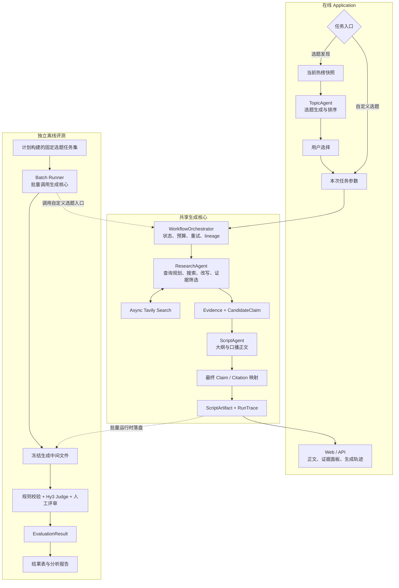

# HyScript 项目方案

> 基于 Hy3 的实时调研与口播文案生成 Agent

| 项目项 | 内容 |
|---|---|
| 对应任务 | 犀牛鸟实战任务 1：开放式场景——AI 应用与评判标准设计 |
| 应用方向 | 内容生产 / 复合型产物评估 |
| 方案版本 | v1.0 |
| 提交日期 | 2026-08-27 |

## 1. 项目摘要

HyScript 面向知识科普、消费趋势、职场和泛科技领域的个人短视频创作者及小型内容团队，
解决选题依据不足、资料检索耗时、事实难以核验、口播初稿质量不稳定和效果难以验证五类问题。

系统以 Hy3 为核心推理与生成模型，支持两种应用入口：一是从当前公开热榜发现并核验候选
选题，二是接收用户已经确定的选题。两种入口随后进入相同的实时调研流程：Hy3 自主规划、
拆分和改写搜索词，通过 Tavily 获取实时信息，整理可追溯证据，再生成干净的口播正文和
独立的论断—来源映射。

评测不嵌入在线 Application。项目另设离线评测 Runner，从计划构建并冻结的选题任务集批量
调用同一生成链路，先冻结输入、查询、搜索结果、证据和文案，再执行规则校验、Hy3 Judge
与人工评审。
这种设计既保留搜索词生成这一 Agent 能力，又使生成与评分可以独立续跑、复核和重放。

## 2. 场景选择与用户价值

### 2.1 目标用户

首版用户限定为制作知识科普、消费趋势、职场和泛科技内容的个人创作者，以及按单人工作流
使用工具的小型内容团队编导或运营。首版输出语言为简体中文，不提供多人审批、自动发布、
数字人、配音或视频生成能力。

系统不建立、推断或跨任务维护创作者画像。受众、平台、时长和风格只作为本次生成任务的
参数，不形成长期用户档案。

### 2.2 待解决的问题

1. **选题依据不足**：热点榜单能反映关注度，但不能直接证明一个内容角度值得创作。
2. **调研成本较高**：创作者需要在多个页面之间搜索、筛选、比较和记录来源。
3. **模型记忆不可靠**：不经过实时检索时，模型可能使用过时信息或生成无来源细节。
4. **口播初稿不稳定**：常见问题包括结构松散、信息密度低、篇幅失控和书面化表达。
5. **效果难以验证**：开放式文案没有唯一答案，需要一套可操作、可复核的评价标准。

### 2.3 引入 Hy3 的必要性

该任务并非一次固定模板填充。不同选题对应不同信息缺口、搜索路径、来源冲突和表达策略，
需要模型根据中间结果动态决策。Hy3 在系统中承担以下工作：

- 将用户选题或热点条目转化为可执行的调研目标；
- 规划多组搜索词，并依据搜索结果补充、收窄或改写查询；
- 从检索结果中筛选可用证据，识别冲突与证据缺口；
- 将证据组织为符合受众、平台、风格和时长要求的口播文案；
- 在离线评测中依据带行为锚点的 Rubric 执行结构化 Judge。

因此，大模型在本项目中不仅负责生成文字，也负责调研计划、过程判断和证据整合。

## 3. 设计思路

### 3.1 核心原则

1. **热榜只用于发现，检索证据用于论证**：榜单排名不能直接充当事实来源。
2. **搜索词由 Agent 实时生成**：主流程和主评测均不向 Agent 预置静态搜索结果。
3. **先证据、后文案**：先形成证据卡片和候选论断，再组织大纲与正文；正文完成后抽取最终
   论断并建立来源映射。
4. **正文与引用分离**：口播正文不混入 URL、引用编号或写作说明，来源在独立面板展示。
5. **证据不足时显式失败**：预算耗尽仍无法支持核心观点时，返回“证据不足”，不伪装成
   可交付正文。
6. **在线应用与离线评测解耦**：在线链路不调用评测器，也不根据离线评分自动修订文案。
7. **真实运行后冻结**：先完成动态检索和生成，再冻结中间产物用于评分、重放与审计。

### 3.2 应用工作流

**入口一：选题发现**

```text
实时获取当前热榜
  → 热点聚合与去重
  → Hy3 规划发现型查询
  → Tavily 实时检索核验
  → 推荐带依据的候选选题
  → 用户选择
  → 深入调研与证据整理
  → 生成口播文案及论断—来源映射
```

**入口二：自定义选题**

```text
用户输入选题与本次任务约束
  → Hy3 规划并动态改写查询
  → Tavily 实时搜索
  → 证据筛选与冲突处理
  → 调研问答与文案大纲
  → 生成口播文案及论断—来源映射
```

## 4. 系统架构



### 4.1 组件边界

| 组件 | 职责 |
|---|---|
| `hyscript.config` | 统一读取根目录 `.env` 与进程环境变量，执行类型转换、校验和密钥脱敏 |
| `hyscript.llm` | 使用 `openai.AsyncOpenAI` 调用 Hy3，统一消息、响应、错误和 Token 元数据 |
| `hyscript.search` | 使用 `AsyncTavilyClient` 完成实时搜索并标准化标题、URL、摘要、时间和得分 |
| `HotlistProvider` | 获取并标准化榜单来源、排名、热度和快照时间 |
| `TopicAgent` | 基于当前热榜和检索核验结果生成、排序候选选题 |
| `ResearchAgent` | 规划查询、并发搜索、判断结果、改写查询并筛选证据 |
| `ScriptAgent` | 依据任务约束、已选证据和候选论断生成大纲与正文，再抽取最终论断并建立来源映射 |
| `WorkflowOrchestrator` | 管理两种入口、阶段状态、预算、重试、取消和 lineage |
| `hyscript.artifacts` | 序列化无评分的 `ScriptArtifact` 与 `RunTrace` |
| `hyscript.evaluation` | 仅供离线 Runner 使用的规则、Judge、人工标注接口和结果聚合 |

### 4.2 核心数据对象

- `Task`：入口模式、选题、目标受众、平台、目标长度、风格和禁用表达；
- `HotlistSnapshot`：榜单来源、榜单时间、获取时间、排名和热度信号；
- `QueryPlan`：调研目标、查询列表、预算和停止条件；
- `SearchResult`：查询、排名、URL、标题、摘要、发布时间和内容哈希；
- `Evidence`：实际进入模型上下文的来源片段及其选择理由；
- `CandidateClaim`：写作前由证据归纳出的候选论断和适用边界；
- `Claim` / `Citation`：从最终正文抽取的可核查论断、重要性、支持状态与来源映射；
- `ScriptArtifact`：干净正文、大纲、版本和引用面板；
- `RunTrace`：输入、配置、实际查询、搜索结果、证据、错误、延迟、成本与 lineage；
- `EvaluationResult`：通过 `run_id` 关联的规则指标、维度分、门控状态和评估器版本。

`EvaluationResult` 不嵌入或回写 `RunTrace`。同一生成产物可以由不同版本的评估器重复评分。

## 5. 重点技术

### 5.1 Hy3 的异步标准化调用

项目使用 Hy3 的 OpenAI 兼容接口，并直接复用 `openai.AsyncOpenAI`，不维护第二套手写 HTTP
传输层。查询规划、证据判断等任务使用推理模式；最终口播正文使用直接输出模式，避免推理
说明进入正文。模型、Endpoint、采样参数、Prompt 版本和 Token 用量均进入运行轨迹。

### 5.2 动态查询规划与受控并发

ResearchAgent 不是把用户选题原样搜索一次，而是先拆分信息需求，再根据首轮结果判断是否
补充、收窄或改写搜索词。同一轮中互不依赖的查询通过异步接口并发执行，并设置并发上限；
依赖上一轮证据的查询改写保持顺序执行。每个任务设置最大调用数、超时、重试和停止条件，
防止 Agent 无限制搜索。

### 5.3 热榜标准化与选题排序

首版只接入允许公开访问、能记录榜单名称与快照时间的 1 至 2 个热榜来源，具体来源在 M1
完成可用性和服务条款核查后冻结。每次选题发现任务获取新快照；若为控制访问频率启用缓存，
缓存有效期不超过 10 分钟，并在结果中显示实际获取时间。

`HotlistProvider` 将条目统一为榜单、排名、热度信号、标题、链接和快照时间。系统先依据
规范化标题和语义相似度去重，再按以下信号排序候选选题：榜单排名、跨榜出现次数、时效性、
Tavily 核验后的证据充足度、与首版内容领域的匹配度以及安全风险。排序不使用创作者画像。
推荐卡片必须给出对应榜单、排名、快照时间、“为什么现在值得做”、初步来源和风险提示。

### 5.4 Tavily 搜索适配与来源标准化

首版搜索服务采用 Tavily。适配层统一官方端点和可选兼容代理的响应结构，保存查询、排名、
URL、标题、摘要、发布时间、服务得分、请求标识与用量信息。搜索服务生成的 Answer 不作为
原始证据，避免把二次生成内容误当作事实来源。

### 5.5 证据驱动生成与论断级追溯

系统要求影响核心结论的外部可核查论断必须有本次检索证据支持。证据对象保留来源片段、
URL、时间和内容哈希。写作前先从证据归纳带适用边界的 `CandidateClaim`，正文完成后再抽取
最终 `Claim` 并建立 `Claim—Citation` 映射。若来源冲突未解决或证据无法覆盖核心观点，
系统停止生成可交付正文并返回证据不足状态。

### 5.6 运行后冻结与可复核评测

离线评测的输入任务集只固定选题和任务约束，不固定搜索词或搜索结果。Runner 批量执行
真实检索与生成，随后把查询顺序、搜索结果、实际证据和文案冻结。评估器只读取冻结文件并
另行写入评分，因此可以：

- 在不重新访问网络的情况下重跑评分；
- 替换 Rubric 或 Judge 后比较评估器版本；
- 从查询、搜索、证据和生成四个阶段定位失败原因；
- 在评分失败时保留已经完成的高成本生成结果。

### 5.7 配置与安全

- API Key 仅通过 `.env` 或进程环境变量注入，`.env` 不进入 Git；
- 配置对象和异常信息不得输出密钥；
- 网页内容视为不可信数据，不允许覆盖系统指令；
- 后续网页正文抓取仅允许 HTTP/HTTPS，并限制重定向、响应大小、MIME、超时和内网地址；
- 公开轨迹只提交有权公开的必要摘要、哈希和脱敏样例。

## 6. 离线评测方案

### 6.1 两阶段评测流水线

```text
eval/datasets 中计划构建并冻结的选题任务集
  → 阶段一：批量实时检索与生成
  → eval/traces/runs 中冻结无评分中间文件
  → 阶段二：规则 / Hy3 Judge / 人工评审
  → eval/results/runs 中保存独立评分
  → eval/reports/generated 中汇总表格与典型案例
```

在线 Application 不等待、不消费这些评分，也不因离线评测失败而失败。

### 6.2 样本集设计

- **Pilot 集**：约 20 条，用于确定搜索预算、Rubric 可读性、运行成本和日志完整性；
- **正式集**：约 100 条是初始规模目标；Pilot 后依据任务级方差、主要效应估计精度和 API
  成本一次性确定正式样本量，并在查看正式结果前冻结；
- **领域覆盖**：知识科普、消费趋势、职场、泛科技；
- **长度覆盖**：短、中、长三个口播长度档位；
- **样本组成**：建议 60% 常规任务、20% 难例、20% 反例或对抗样本；
- **样本字段**：选题、受众、平台、长度、风格、禁用表达、难度和样本来源说明。

难例与反例包括选题歧义、信息不足、来源冲突、过时页面、不可访问来源、错误时间范围、
无关引用、伪造引用、重复凑字数、自我评价、术语堆砌和网页提示注入。

### 6.3 关键指标口径

Pilot 前建立版本化指标字典，避免在正式实验后改变定义。首版采用以下口径：

- `Evidence Yield`：一次任务中通过证据筛选的去重证据条数 ÷ 实际搜索调用次数；
- 核心信息覆盖率：获得有效证据支持的预先标注核心信息点数 ÷ 该任务核心信息点总数；
- 核心论断支持率：至少有一个有效证据片段支持的核心论断数 ÷ 核心论断总数；
- 来源可访问：生成时请求成功，或冻结轨迹中保留了当次实际使用且有权保存的证据片段；
- 重大问题：改变核心结论、触发门控或必须重写整段才能修复的问题；
- 局部问题：不改变核心结论，可通过单句或局部措辞修改修复的问题。

核心信息点由人工在 Pilot/正式任务运行前标注；若一个任务无法预先建立可靠信息点，则只进入
案例分析，不用于核心信息覆盖率计算。详细分子、分母、缺失值和外部服务失败处理随指标字典
一同冻结。

### 6.4 八个质量维度

| 维度 | 可操作的主要判据 | 主要评估方式 |
|---|---|---|
| 1. 需求与选题契合度 | 是否覆盖任务中的选题、受众、平台、风格、长度和禁用要求；是否偏离核心角度 | 规则 + Judge |
| 2. 事实准确性 | 核心事实是否与冻结证据一致；是否忽略反证、扩大结论或捏造数字 | 论断级核验 + Judge + 人工抽检 |
| 3. 证据可追溯性 | 核心可核查论断是否映射到实际证据；来源是否可访问且确实支持论断 | 规则 + 论断级核验 |
| 4. 信息价值与密度 | 在目标篇幅内是否提供足量有效信息；是否存在空话、重复和无关扩写 | 规则 + Judge |
| 5. 吸引力与记忆点 | 开头是否快速建立问题或利益点；是否有具体、可信且非标题党的记忆点 | Judge + 人工评审 |
| 6. 口播流畅性 | 是否存在过长句、书面标签、引用编号和难以朗读的结构；语气是否符合口播 | 规则 + Judge + 人工评审 |
| 7. 逻辑结构完整性 | 开场、背景、核心信息、转折和收束是否完整；段落关系是否可跟随 | Judge + 人工评审 |
| 8. 安全合规性 | 是否出现高风险建议、误导承诺、歧视、隐私泄露或禁用表达 | 规则 + Judge + 人工复核 |

每个维度采用带行为锚点的 0 至 4 分制。通用分档原则如下，具体阈值在 Pilot 后固化到版本化
Rubric：

- **4 分**：满足该维度全部强制条件，无重大问题，最多 1 个不影响使用的轻微问题；
- **3 分**：满足全部强制条件，存在 2 至 3 个局部问题，不需要改变核心内容；
- **2 分**：存在 1 个重大问题或超过 3 个局部问题，需要重写部分段落；
- **1 分**：缺失核心要求或存在多个重大问题，文案需大范围重写；
- **0 分**：输出缺失、严重跑题，或该维度触发不可接受的事实/安全问题。

严重事实错误、伪造引用和严重合规问题属于门控项。触发后结果直接判为不合格或设置总分
上限，不能由吸引力、篇幅准确等其他分数抵消。

### 6.5 评估方法组合

1. **确定性规则**：计算字数误差、长度命中、引用覆盖、重复比例、非正文标签和禁用表达；
2. **Hy3 Judge**：使用结构化输出和版本化 Rubric 给出维度分、证据和理由；
3. **人工评审**：对关键样本进行盲评，用于事实抽检、口播可用性判断和 Judge 校准；
4. **门控与聚合**：先执行事实、引用、安全门控，再计算维度统计，不用平均分掩盖严重错误。

### 6.6 实验设计

**查询 Agent 消融**

- S0：直接使用用户选题执行一次搜索；
- S1：Hy3 一次性改写为一个查询并执行一次搜索；
- S2：Hy3 预先生成多查询计划，在固定预算内执行但不根据结果改写；
- S3：Hy3 生成多查询计划，并依据中间结果自适应改写。

各组使用相同搜索服务、最大调用预算和结果上限，同时报告证据产出、质量、延迟和成本。

**端到端对比**

- E0：只提供选题和目标长度，以最小提示让 Hy3 单轮直接生成，不使用实时检索；
- E1：输入字段与 E0 相同，但使用明确角色、结构、受众、风格和输出约束的版本化提示，
  不使用实时检索；
- E2：把实时搜索结果直接作为上下文后生成；
- E3：使用实时检索、证据卡片和分步生成的完整流程。

可选 E4 仅作为离线研究组：在冻结 E3 产物后，使用评估器反馈生成单轮修订稿。E4 不进入
在线 Application，且最终评价使用未参与修订的保留 Judge 与盲化人工结果。

### 6.7 评估器有效性验证

1. **判别力验证**：为同一任务构造好、中、差三档输出，报告排序准确率和成对准确率；
2. **人工一致性**：计划由 3 名评审者盲评 40 至 50 个案例；0 至 4 分有序维度以 ordinal
   Krippendorff Alpha 为主要统计量，它允许处理少量缺失标注；成对加权 Kappa 和总分 ICC
   仅作诊断，并保留分歧与仲裁记录；
3. **重复稳定性**：同一 Judge 对同一输出至少重复评测 3 次，报告均值、标准差和排序相关；
4. **对抗性验证**：测试伪造引用、篇幅堆砌、术语堆砌和自我评价能否骗取错误高分；
5. **典型案例归因**：把失败归因到查询、搜索、证据、生成或评估阶段，而不是只展示总分。

40 至 50 条人工样本和约 100 条正式任务均为方案阶段的起始估计。最终规模根据 Pilot 的任务级
方差、置信区间宽度、评审成本和 API 成本确定，决定过程在正式结果生成前记录并冻结。

## 7. 预期效果与验收指标

以下阈值是项目自行提出的工程验收与预注册目标，不是委员会规定，也不代表已经取得的实验
结果。它们用于定义“达到可用和可相信”的最低期望；Pilot 后允许根据方差、成本和标注可行性
统一调整一次并记录理由，随后在正式实验开始前冻结。

| 类别 | 预期效果 / 初始验收目标 |
|---|---|
| 应用完整性 | 支持选题发现与自定义选题两种入口，并完成实时检索、证据整理和口播文案生成 |
| 动态检索 | 搜索词由 Agent 在运行时生成和改写；相同预算下，S3 的 Evidence Yield 与核心信息覆盖优于 S0 |
| 可追溯性 | 成功运行的 `RunTrace` 必填字段完整率达到 100%；标记为可交付正文的核心可核查论断支持率必须达到 100%，全部可核查论断支持率目标不低于 90% |
| 文案可用性 | 目标长度区间命中率不低于 85%，正文不含 URL、引用编号、写作说明或评分诱导内容 |
| 失败透明度 | 搜索失败、证据不足和来源冲突均有明确状态，不静默伪造事实或来源 |
| 评估器判别力 | 好、中、差输出的成对排序准确率目标不低于 80% |
| 人工一致性 | 关键维度与人工评审达到中等及以上一致性，目标 ordinal Krippendorff Alpha 不低于 0.60 |
| Judge 稳定性 | 同一输出重复评测的维度均分标准差目标不高于 0.40（0 至 4 分制） |
| 对抗鲁棒性 | 对伪造引用、无关引用和明显堆砌样本的识别率目标不低于 80% |
| 工程安全 | 仓库不包含 API Key、私有数据或未获许可的网页全文；网络错误不泄露密钥和请求细节 |

项目最终希望验证两项核心结论：第一，动态查询规划与证据组织能否在受控成本下提升口播
文案的事实可靠性和可用性；第二，自定义评估器能否稳定区分输出质量，并与人工判断保持
可接受的一致性。

## 8. 时间规划

以 2026-08-27 为项目方案起点，拟按七周推进：

| 阶段 | 时间 | 状态 | 主要工作 | 阶段产出 / 退出条件 |
|---|---|---|---|---|
| M0 基础可行性 | 08-27 ～ 09-02 | 进行中（基础适配已完成） | 完成 Hy3、Tavily、统一配置、异步接口、错误脱敏与核心 Schema 草案 | 最小真实调用通过；配置和错误不泄露密钥；基础单元测试通过 |
| M1 实时检索与证据 | 09-03 ～ 09-09 | 待开始 | 实现查询计划、并发搜索、动态改写、证据筛选、候选论断与最终 Claim—Citation 映射 | 自定义选题可跑通检索；生成轨迹可落盘并重放下游阶段 |
| M2 端到端 Application | 09-10 ～ 09-16 | 待开始 | 实现热榜接入、TopicAgent、ScriptAgent、Orchestrator 与最小 Web/API | 两种入口均可生成正文、来源面板和无评分轨迹 |
| M2.5 批量生成 Runner | 09-17 ～ 09-23 | 待开始 | 建立数据集格式、批量生成、并发限制、断点续跑与冻结文件 | 约 20 条 Pilot 任务完成实时生成并保存完整中间产物 |
| M3 评估器与有效性 Pilot | 09-24 ～ 09-30 | 待开始 | 完成八维 Rubric、规则、Hy3 Judge、人工标注和判别力/一致性 Pilot | 冻结正式 Rubric、门控阈值、样本量、Prompt 与统计方案 |
| M4 正式实验与分析 | 10-01 ～ 10-07 | 待开始 | 执行查询消融、端到端对比、稳定性与对抗性验证 | 输出完整结果表、置信区间、典型案例和失败模式 |
| M5 开源交付 | 10-08 ～ 10-14 | 待开始 | 整理 README、配置样例、评测材料、报告和 2 分钟 Demo/GIF | 仓库安全检查通过，运行说明可复现，全部活动产出齐备 |

若外部 API 额度或活动截止时间发生变化，将优先保证 M0 至 M3 和任务要求中的判别力、
一致性验证完整，正式样本量依据 Pilot 成本调整并在报告中说明，不根据结果好坏删减样本。

## 9. 当前进度

截至方案提交日，项目已经完成：

- 项目目录、依赖与 `.env.example`；
- 统一的 `hyscript.config.settings` 配置层；
- 基于 `openai.AsyncOpenAI` 的异步 Hy3 适配器；
- 基于 `AsyncTavilyClient` 的异步搜索适配器和标准化结果；
- Tavily 官方端点及可选兼容代理响应适配；
- 不包含评分的 `RunTrace` 数据结构；
- Hy3 与 Tavily 的真实连通性验证；
- 23 个离线单元测试，覆盖配置、异步客户端、响应标准化和密钥脱敏。

可使用以下命令复核当前测试；真实集成测试需要显式设置 `HYSCRIPT_RUN_LIVE_TESTS=1`，并会
消耗 API 额度：

```bash
uv run --no-sync python -m unittest discover -s tests/unit -p 'test_*.py' -v
HYSCRIPT_RUN_LIVE_TESTS=1 uv run --no-sync python -m unittest discover -s tests/integration -p 'test_*.py' -v
```

当前尚未配置公开 CI，以上进度依据方案提交日的本地测试结果记录。

TopicAgent、ResearchAgent、ScriptAgent、工作流编排、Web/API 和离线评估器目前处于后续实现
阶段，本方案没有将这些规划描述为已经完成的功能。

## 10. 风险与应对

| 风险 | 影响 | 应对措施 |
|---|---|---|
| 搜索结果随时间变化 | 实验组难以公平比较 | 相近时间交错运行各组，固定服务与预算，保存完整查询和结果 |
| 外部 API 限流或额度不足 | 批量实验中断或成本超限 | Pilot 估算成本，限制并发、调用数和重试，支持断点续跑 |
| 来源不可访问或相互冲突 | 论断无法复核 | 记录失败状态，继续补搜；冲突未解决时返回证据不足 |
| LLM Judge 同源偏差 | 评估结果偏向 Hy3 表达习惯 | 结合规则、盲化人工、重复评测和保留 Judge，不以单一模型分数下结论 |
| Rubric 描述模糊 | 不同评审者结论差异大 | 使用行为锚点、错误数量和阈值，Pilot 后冻结版本 |
| 网页提示注入与 SSRF | 外部内容干扰 Agent 或访问内网 | 内容与指令隔离，限制协议、地址、MIME、重定向和响应大小 |
| 项目范围过大 | 无法按期完成可验证版本 | 首版限制四类知识内容、单一搜索服务、简体中文和文本产物 |
| 公开轨迹涉及版权或隐私 | 无法公开复核材料 | 仅公开必要摘要、哈希和脱敏样例，完整轨迹本地保存 |

## 11. 计划产出

1. **开源应用**：源码、README、环境配置样例、运行说明和最小 Web/API；
2. **评测材料**：固定选题任务集、八维 Rubric、规则与 Judge 脚本、人工标注接口；
3. **完整结果**：查询消融、端到端对比、判别力、一致性、稳定性和对抗性结果表；
4. **分析报告**：场景选择、技术方案、评测依据、失败模式、能力边界和典型案例；
5. **演示材料**：时长不超过 2 分钟的 Demo 视频或 GIF；
6. **可复核产物**：脱敏后的生成轨迹、评分结果和汇总报告样例。

## 12. 与实战任务要求的对应关系

| 任务要求 | 本项目对应设计 |
|---|---|
| 面向明确真实用户场景 | 面向四类知识型短视频创作者的实时调研与口播文案生成 |
| 基于 Hy3 构建可运行应用 | Hy3 用于查询规划、证据判断、文案生成与离线 Judge |
| 5 个以上关键评估维度 | 定义事实、证据、价值、吸引力、口播、结构、安全等八维 Rubric |
| 自动或半自动评测 | 规则校验 + Hy3 Judge + 盲化人工评审 |
| 样本包含难例与反例 | Pilot/正式集均分层，计划包含 20% 难例和 20% 反例或对抗样本 |
| 判别力验证 | 对同一任务的好、中、差输出执行排序和成对准确率验证 |
| 一致性验证 | 人工一致性与 Judge 重复稳定性双重验证 |
| 完整评测与案例归因 | 独立 Runner 批量生成、冻结、评分并按阶段归因 |
| 开源与密钥安全 | `.env.example` 提供配置格式，真实密钥和本地资料均由 Git 忽略 |
| 2 分钟以内 Demo | 展示热榜选题、动态查询、证据卡片和最终口播文案 |

## 13. 项目说明与参考

HyScript 为腾讯犀牛鸟实战项目。模型能力通过 Hy3 完成，不以训练或微调模型为项目重点。

- Hy3 项目：https://github.com/Tencent-Hunyuan/Hy3
