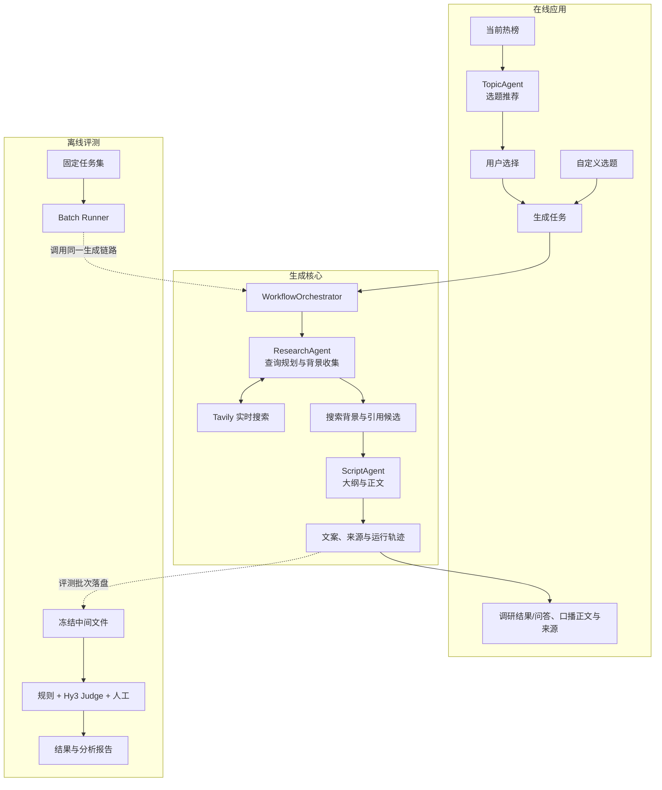

# HyScript 项目方案

> 基于 Hy3 的实时调研与口播文案生成 Agent

## 1. 项目概述

HyScript 面向知识科普、消费趋势、职场和泛科技领域的个人短视频创作者，帮助用户完成选题发现、资料调研和口播文案生成。首版输出简体中文文本，不涉及创作者画像、自动发布、配音或视频生成。

创作者在准备口播内容时，通常需要先判断选题是否值得做，再搜索资料、核对事实并整理成稿。现有大模型可以快速生成文字，但直接生成容易出现信息过时、内容空泛和事实无来源等问题。本项目通过 Hy3 API 调用大语言模型完成调研决策和文案生成，通过 Tavily 获取实时信息，使文案建立在本次调研结果之上。

项目由在线应用和离线评测两部分组成。在线应用只负责选题、调研和生成；离线脚本使用固定任务集批量运行同一生成链路，再对保存的结果进行评分。两部分相互独立，评测结果不会影响在线生成流程。

## 2. 设计思路

### 2.1 在线应用

```text
选题发现：当前热榜 → 热点聚合与检索核验 → 推荐选题 → 用户选择 → 深入调研/问答 → 生成文案
自定义选题：用户输入选题 → 深入调研/问答 → 生成文案
```

选题发现以当前公开热榜为起点，推荐依据来自榜单信息和实时检索结果，不使用创作者画像。用户确定选题后，可设置受众、平台、目标长度和表达风格，再进入统一的调研与生成流程。调研阶段支持围绕选题继续提问，必要时补充搜索。

- 热榜用于发现线索，实时搜索为写作补充当前背景；
- 搜索词由 Agent 在运行时生成，并根据中间结果继续补充或改写；
- 搜索背景直接提供给 Hy3 写作，不在生成阶段建立 claim、标题链或 Grounding 审核；
- 口播正文以吸引力、信息价值和成稿质量为主，来源作为正文外引用元数据保存；
- 引用元数据供离线评分核查，不要求出现在正文中。

### 2.2 离线评测

这里的“离线”是指评测脱离在线产品请求，不代表生成阶段断网。批量生成仍会调用 Hy3 和 Tavily；生成完成后的评分只读取已保存的文件。

```text
固定选题任务集
  → 批量调用自定义选题生成链路
  → 保存输入、动态查询、搜索背景、引用元数据和文案
  → 规则评测、Hy3 Judge 和人工评审
  → 汇总结果与案例分析
```

任务集只固定选题和生成要求，不固定搜索词或搜索结果。Agent 仍需在每次运行中自主生成查询并实时搜索。生成完成后，中间文件按每次运行的唯一 `run_id` 保存；评分另行保存，不回写生成过程。这样可以在不重复调用搜索和生成接口的情况下重跑评分。

首版评测对象是选题确定后的调研与文案生成能力。热榜发现和选题推荐作为应用功能进行演示，不纳入口播文案质量评测。

## 3. 系统架构



| 模块 | 作用 |
|---|---|
| `TopicAgent` | 对当前热榜标题做 embedding 事件聚类，再由 Hy3 并发生成待核验选题 |
| `ResearchAgent` | 规划查询并收集用于写作的实时背景和引用候选 |
| `ScriptAgent` | 根据任务要求和背景生成有吸引力的口播文案，并返回正文外引用 ID |
| `WorkflowOrchestrator` | 管理流程状态、搜索预算、重试和中间产物 |
| `Batch Runner` | 批量调用生成链路并保存运行结果 |

## 4. 重点技术

| 技术 | 项目中的用途 |
|---|---|
| Hy3 API | 调用 Hy3 大语言模型完成查询规划和文案生成 |
| 异步调用 | 模型与搜索接口均使用异步客户端，并发执行互不依赖的请求 |
| 热榜与实时检索 | 接入 1～2 个公开热榜并记录榜单、排名和快照时间；通过 Tavily 获取最新资料 |
| 背景增强生成 | 将实时搜索材料作为写作背景，并把实际采用的来源作为正文外元数据保存 |
| 运行轨迹冻结 | 保存输入、查询、搜索结果、引用元数据和输出，支持重复评分与问题定位 |
| 统一配置 | 由 `hyscript.config.settings` 读取 `.env`，密钥不进入代码和 Git |

## 5. 评测方案

口播文案没有唯一标准答案，因此评测同时关注任务要求、事实依据和表达质量。项目采用“规则 + Hy3 Judge + 人工评审”的组合方式，避免只依赖单一分数判断结果。

### 5.1 评测数据

- Pilot 集约 20 条，用于检查流程、成本和评分标准；
- 正式集计划约 100 条，覆盖四个目标领域和不同文案长度；
- 样本包含常规任务、难例和反例；
- 难例包括选题歧义、资料不足、来源冲突和信息过时；
- 反例包括伪造引用、无关引用、重复凑字数、术语堆砌、自我评价和网页提示注入。

### 5.2 评价维度

| 维度 | 主要判断内容 |
|---|---|
| 选题匹配度 | 是否精准命中选题及其核心人群 |
| 主题明确与信息量 | 是否主题清晰、论证扎实、有增量信息，并避免明显事实编造 |
| 吸引力 | 开头、中段节奏和结尾钩子能否持续建立兴趣 |
| 口播流畅度 | 是否自然凝练，避免过雅和过俗 |
| 修辞与记忆点 | 修辞是否恰到好处并形成传播记忆点 |
| 语言逻辑与结构 | 观点、因果、过渡和论证是否形成逻辑闭环 |
| 合规性 | 是否存在平台、法律、伦理或误导风险 |

Judge 七个维度采用 1～3 分制。引用作为正文外背景，仅辅助“主题明确与信息量”判断明显编造和
论证扎实程度，不单独形成第八维。字数由规则独立评分，并与七维分数直接相加后归一化；Reward
hacking 独立检测。

### 5.3 评测方法

- **规则评测**：检查字数误差、引用 ID 合法性、重复内容、禁用表达和非正文标签；
- **Hy3 Judge**：由 Hy3 按统一评分细则输出各维度分数、问题位置和理由；
- **人工评审**：计划由 3 名评审者对 40～50 条样本盲评，用于核查事实、口播可用性和 Judge 偏差；
- **结果分析**：统计各维度表现，并将问题归因到查询、搜索、证据或生成阶段。

### 5.4 对比与有效性验证

项目将比较直接搜索、一次改写、多查询规划和根据结果动态改写四种查询方式，观察证据覆盖、文案质量、延迟和成本的变化。端到端实验则比较直接生成、结构化提示生成、加入搜索结果生成和完整 Agent 流程。

评估器从四个方面验证：使用好、中、差样本检查判别力；比较 Judge 与人工评分的一致性；对同一结果重复评分检查稳定性；使用伪造引用、内容堆砌等反例检查抗干扰能力。

## 6. 预期效果

1. 跑通选题发现和自定义选题两种入口；
2. Agent 能根据选题和搜索结果自主规划、补充和改写查询；
3. 可交付文案额外携带本次实际采用的引用元数据，正文无需显示引用；
4. 文案长度落在目标值 ±10% 范围内的比例不低于 85%；
5. 动态查询在相同最大搜索预算下，比直接搜索获得更高的核心信息覆盖率；
6. 评估器对好、中、差样本的成对排序准确率不低于 80%，与人工评分的 Krippendorff α 不低于 0.60；
7. 最终报告能够说明完整流程相对直接生成的改进、成本和适用边界。

## 7. 时间规划

| 时间 | 主要工作 | 阶段产出 |
|---|---|---|
| 08-27 ～ 09-02 | 完成 Hy3、Tavily、统一配置和基础数据结构 | 模型与搜索接口可调用，基础测试通过 |
| 09-03 ～ 09-09 | 实现查询规划、动态改写和背景整理 | 自定义选题调研链路可运行 |
| 09-10 ～ 09-16 | 实现热榜接入、选题推荐、文案生成和最小 Web/API | 在线应用两种入口可运行 |
| 09-17 ～ 09-23 | 实现批量 Runner 和中间文件保存，运行 Pilot | 获得首批完整生成轨迹 |
| 09-24 ～ 09-30 | 完成 Rubric、规则评测、Hy3 Judge 和人工标注 | 冻结正式评测方案 |
| 10-01 ～ 10-07 | 执行对比实验和有效性验证 | 形成结果表与案例分析 |
| 10-08 ～ 10-14 | 整理代码、文档、报告和演示材料 | 完成开源交付与 2 分钟 Demo |

## 8. 当前进度与计划产出

目前已完成项目目录、依赖和统一配置；实现了 Hy3 与 Tavily 的异步调用和响应标准化；完成真实接口连通性测试，以及配置、客户端、结果解析和密钥脱敏等单元测试。Agent 工作流、在线应用和离线评估器仍在后续开发阶段。

- 可运行的应用源码、配置示例和使用说明；
- 固定任务集、评测 Rubric、批量生成与评分脚本；
- 对比实验结果、典型案例和问题分析；
- 不超过 2 分钟的 Demo 视频或 GIF。

参考项目： [Tencent-Hunyuan/Hy3](https://github.com/Tencent-Hunyuan/Hy3)
