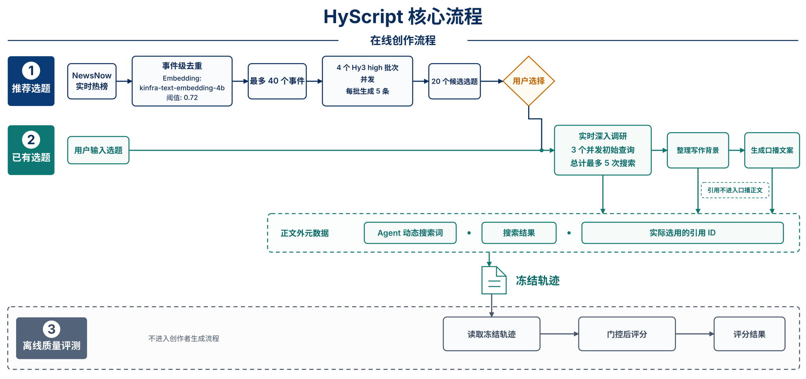

# HyScript

> 腾讯犀牛鸟实战项目

**项目方案：** [设计思路、架构、重点技术、预期效果与时间规划](PROJECT_PROPOSAL.md)

面向知识型短视频创作者的实时调研与口播文案生成 Agent。系统从当前公开热榜发现候选选题，
使用 Hy3 生成检索计划，通过 Tavily 执行实时搜索，将结果作为写作背景生成可直接口播的短视频文案。引用信息作为正文外元数据供离线评分使用；项目不建立或维护创作者画像。

## 核心流程



## 项目目录

- `src/hyscript/`：可复用的业务实现。
- `app/`：API 与 Web 应用入口。
- `examples/`：最小调用示例，只调用 `src/hyscript/` 中的实现。
- `eval/`：计划构建的固定选题任务集、Rubric、批量生成中间文件、独立评分结果与报告。
- `tests/`：单元测试与需要真实服务的集成测试。
- `scripts/`：离线批量生成、评测和报告导出命令。

## 快速开始

运行环境要求 Python 3.12+ 和 [uv](https://docs.astral.sh/uv/)。复制配置模板并填写必要配置。

```bash
cp .env.example .env
uv sync
```

至少需要分别填写以下两套模型服务配置：

```dotenv
HY3_BASE_URL=https://your-hy3-service.example.com/v1/chat/completions
HY3_API_KEY=your-hy3-key
HY3_MODEL=hy3

EMBEDDING_BASE_URL=https://your-embedding-service.example.com/v1/embeddings
EMBEDDING_API_KEY=your-embedding-key
EMBEDDING_MODEL=kinfra-text-embedding-4b
```


### 跨平台桌面端 GUI

完成 `.env` 配置和 `uv sync` 后，在 Windows、macOS 或带图形会话的 Linux 桌面运行：

```bash
uv run --no-sync python -m app.desktop
```

### 二次开发及调试

#### 调用示例

```python
import asyncio

from hyscript.config import settings
from hyscript.llm import AsyncHy3Client, ChatMessage


async def main() -> None:
    messages = [
        ChatMessage(role="user", content="用一句话说明什么是证据驱动写作。"),
    ]
    async with AsyncHy3Client(settings.hy3) as client:
        result = await client.chat(messages)
    print(result)


asyncio.run(main())
```

项目采用原生异步 I/O：Hy3 与 embedding 分别使用独立的 OpenAI 兼容 `AsyncOpenAI`
客户端，Tavily 使用已安装 SDK 的 `AsyncTavilyClient`。Hy3 和 embedding 可以来自完全不同的服务商；Agent、API 和示例统一使用异步接口，并在上下文管理器退出时关闭连接池。


#### 运行最小示例

```bash
# 调用 Hy3，验证最基础的 LLM 对话能力
uv run --no-sync python examples/01_llm_call.py

# 调用 Tavily，验证搜索服务是否可用
uv run --no-sync python examples/02_search_call.py

# 从当前公开热榜生成选题推荐
uv run --no-sync python examples/03_topic_recommendations.py

# 围绕指定话题完成实时调研并生成约 450 字的口播稿
uv run --no-sync python examples/04_end_to_end.py \
  "行业自律能终结新能源车恶性竞争吗？" --target-length 450
```

## 离线评分

```bash
uv run --no-sync python scripts/run_evaluation.py score \
  --trace-dir eval/traces/runs/<batch-id> \
  --evaluators rules,judge \
  --output-dir eval/results/runs/<evaluation-id> \
  --concurrency 2
```
